# Xnoob Blog Template

——by runoneall

> 你是否想快速拥有一个属于自己的博客？

> 你是否不会或不精通 HTML CSS JS 这些写网页的编程语言？

> 那么你来对地方了。。。

## Xnoob Blog Template 使用易学易懂的Python语言编写而成，并已经内置了博客的一些基础功能，只需调节几个参数就可以开始使用！

想开始使用了吗？首先，你需要：

1. 安装Python `建议使用Python 3.x`
2. 安装Git
3. 安装Flask `pip install flask`
4. 安装Pywebio `pip install pywebio`
5. 将博客代码拉取到本地
6. 进入博客文件夹，你会看到两个文件夹以及三个文件
7. 运行 `python main.py`

如果不出意外的话，你的博客已经开始运行了，访问 [127.0.0.1:8501](http://127.0.0.1:8501/) 查看：

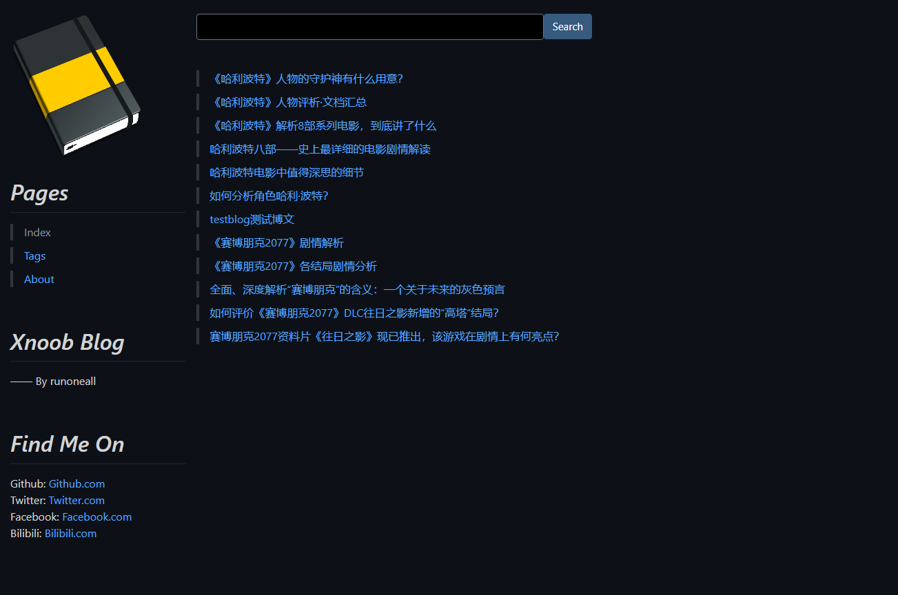

如果你没有改动任何配置项，博客的页面和这个是一模一样的，当然我不建议你这么做，所以下面是所有配置项的用法，它们存放在 `config.py`中：

* 更改博客名称

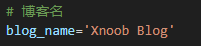

页面Title，首页，后台标题等一切涉及到博客名称的地方都会用到这个配置项

* 更改开发者名称

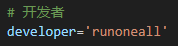

博客的开发者，首页的 `By` 的地方会用到

* 更改主题

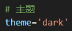

博客页面主题有 `dark` | `sketchy` | `minty` | `yeti`

* 更改页面最大宽度

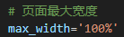

值越接近 `100%` 页面两侧的留空面积越小

* 更改路由及对应的页面

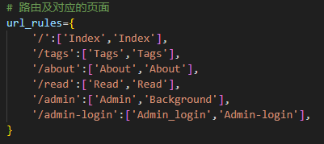

`url_rules` 类型为 `字典（dict）`，由 `键值对`构成，键是绑定的 `路由（path）`，值为 `数组（list）`，`第一项`是页面函数的名称，`第二项`是在博客页面侧边栏中的 `Pages` 中显示的名称

* 更改排除的页面

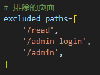

有一些页面无需显示在博客页面侧边栏中的 `Pages` 中，`excluded_paths` 的类型为 `数组（list）`，只需要将想不显示的页面所对应的 `路由（path）`放入该数组中，页面就不会显示在侧边栏中的 `Pages` 中，但仍可以通过对应的路由访问该页面

* 更改起始地址

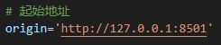

起始地址包括 `协议`，`Host`，`端口`

* 更改页面外观设置

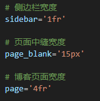

* 更改资源文件夹路径

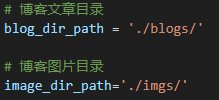

资源文件夹路径可为 `相对路径` 或 `绝对路径`

* 更改管理员登录信息

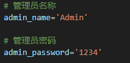

`管理员名称` 和 `管理员密码` 用于登录博客后台

* 更改个人联系方式

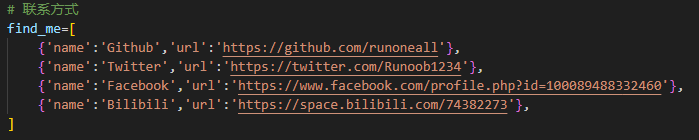

将 `name` 项换为 `别名` ，将 `url` 项换为 `主页地址`
